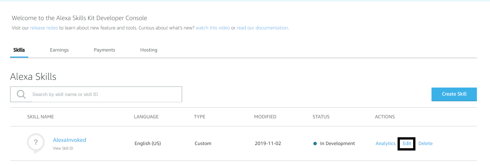
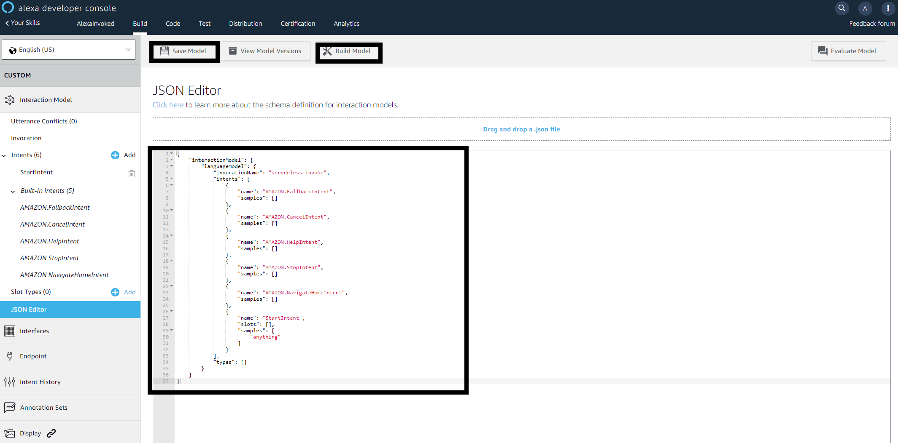

# Alexa Invoked Serverless Function

```bash
# Install serverless globally
npm i -g serverless
# Create new serverless project - walkthrough nodejs or python
sls
# Change directory to project
cd <project_name>
# Install serverless alexa skill plugin
sls plugin install -n serverless-alexa-skills
```

Replace your `handler.py` with the following code:

```python
def hello(event, context):
    response = {
        'version': '1.0',
        'response': {
            'outputSpeech': {
                'type': 'PlainText',
                'text': 'Hello World!'
            }
        }
    }

    return response

```

Login to [Amazon Developer Console](https://developer.amazon.com/settings/console/securityprofile/overview.html)


Click on `Create a New Security Profile`


Enter anything for `Security Profile Name` and `Security Profile Description`


Click on `Web Settings` tab and click the `Edit` button


Input `http://127.0.0.1:9090/cb` for `Allowed Return URLs`. Then click `Save`. Use 127.0.0.1 not localhost


Take note of your `Client ID`, `Client Secret` and your `Vendor ID` located [here](https://developer.amazon.com/settings/console/mycid)

Append the following to the end of your `serverless.yml` file  

```yml
custom:
  alexa:
    vendorId: ${env:AMAZON_VENDOR_ID}
    clientId: ${env:AMAZON_CLIENT_ID}
    clientSecret: ${env:AMAZON_CLIENT_SECRET}
```

Then, run the following command:

```bash
sls alexa auth
```

The command opens a login page. You'll be redirected after authenticating and if successful, you'll see the message: `Thank you for using Serverless Alexa Skills Plugin!!`

Run this command to create a new Alexa skill
```bash
# $YOUR_SKILL_LOCALE -> en-US
# $YOUR_SKILL_TYPE -> custom

sls alexa create --name $YOUR_SKILL_NAME --locale $YOUR_SKILL_LOCALE --type $YOUR_SKILL_TYPE
```

Take note of the `Skill ID` then make the following changes to the handler function in `serverless.yml`

```yml
functions:
  hello:
    handler: handler.hello
    events:
      - alexaSkill: ${env:AMAZON_ALEXA_SKILL_ID}
```

Deploy your function

```bash
sls deploy -v
```

Take note of your lambda function arn from the stack output of this command.
`arn:aws:lambda:<locale>:<amazon_id>:function:<function_name>`
Remove anything after the function name, ex. `:1`

Go to the Alexa console [here](https://developer.amazon.com/alexa/console/ask)

Click `Edit` on the Alexa skill you made 



Click `Choose`


Go to `Endpoints` tab and input your lambda function arn into `Default Region`. Afterwards, click `Save Endpoints`


Go to `JSON Editor` and paste in the following. Change the `invocationName` to whatever you want the name you call to invoke the skill. Click `Save Model` and `Build Model`

```json
{
    "interactionModel": {
        "languageModel": {
            "invocationName": "serverless invoke",
            "intents": [
                {
                    "name": "AMAZON.FallbackIntent",
                    "samples": []
                },
                {
                    "name": "AMAZON.CancelIntent",
                    "samples": []
                },
                {
                    "name": "AMAZON.HelpIntent",
                    "samples": []
                },
                {
                    "name": "AMAZON.StopIntent",
                    "samples": []
                },
                {
                    "name": "AMAZON.NavigateHomeIntent",
                    "samples": []
                },
                {
                    "name": "StartIntent",
                    "slots": [],
                    "samples": [
                        "anything"
                    ]
                }
            ],
            "types": []
        }
    }
}
```



Lastly, go to the `Test` tab. Select `Development` on the dropdown for `Skill testing is enabled in`. Finally, type into the text field `open <invocationName>`


# References

https://github.com/marcy-terui/serverless-alexa-skills  
https://medium.com/@rupakg/how-to-build-a-serverless-alexa-skill-51d8479e0432  
https://serverless.com/blog/how-to-manage-your-alexa-skills-with-serverless/  
https://forums.developer.amazon.com/questions/94166/alexa-skill-cant-work-after-changed-the-invocation.html  
https://github.com/serverless/examples/tree/master/aws-python-alexa-skill
https://blog.alexellis.io/serverless-alexa-skill-mobymingle/
https://developer.amazon.com/docs/custom-skills/host-a-custom-skill-as-an-aws-lambda-function.html

# Afterwards

I went with using the Alexa GUI because `sls alexa build` gave me the following error: `StatusCodeError: 429 - "{\"message\":\"We are experiencing heavy traffic at the moment. Please try again later.\"}"`

You can probably skip all of this and just make a new skill just by selecting Alexa-hosted Python


